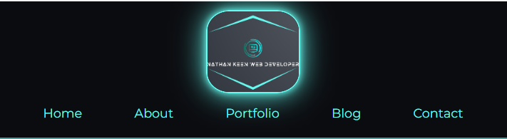
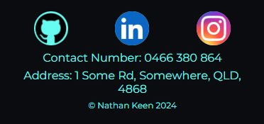
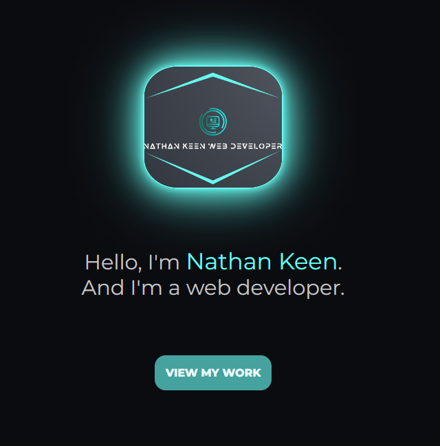
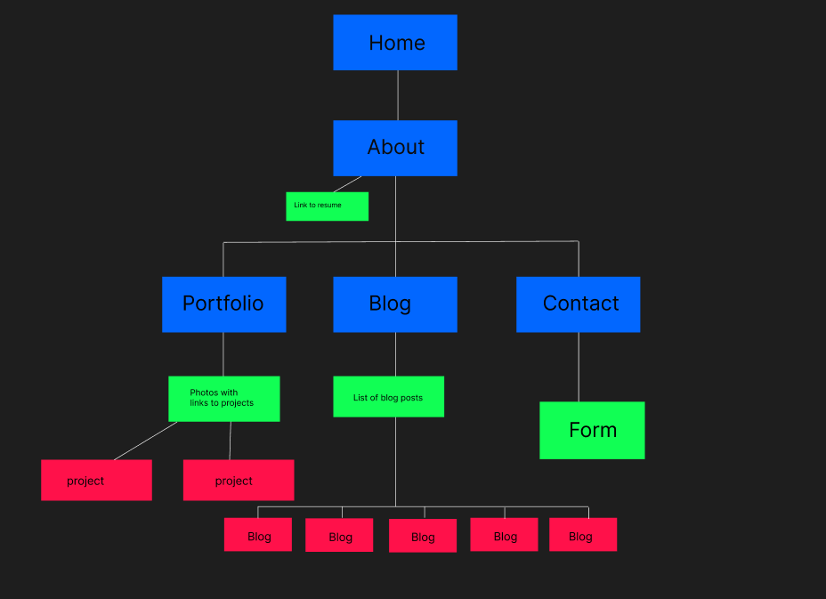
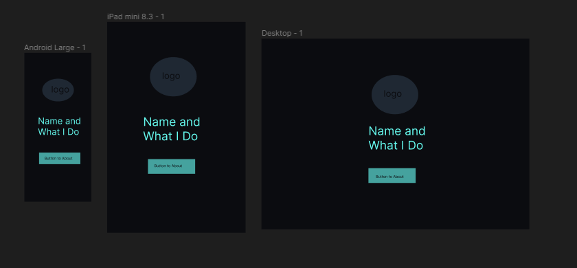
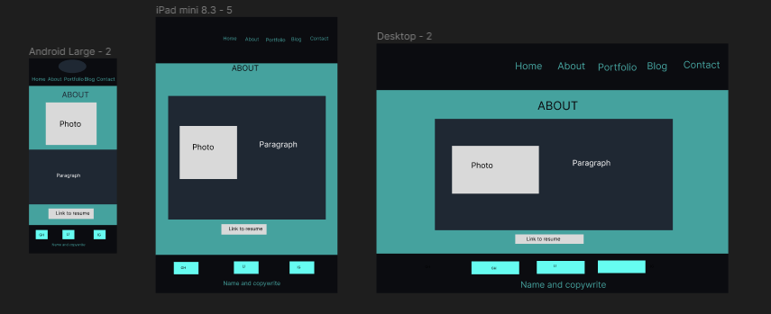
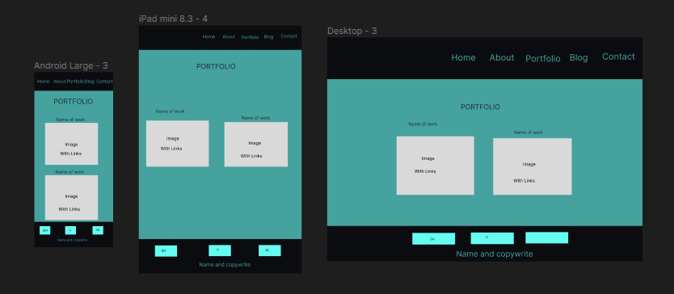
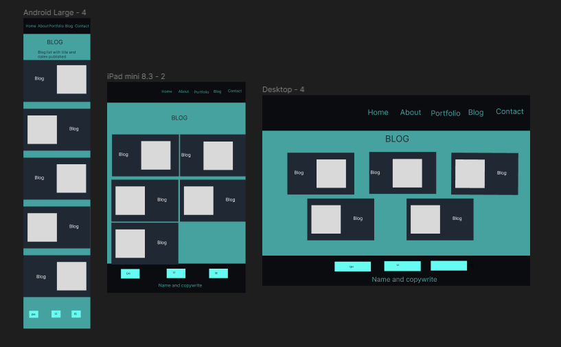
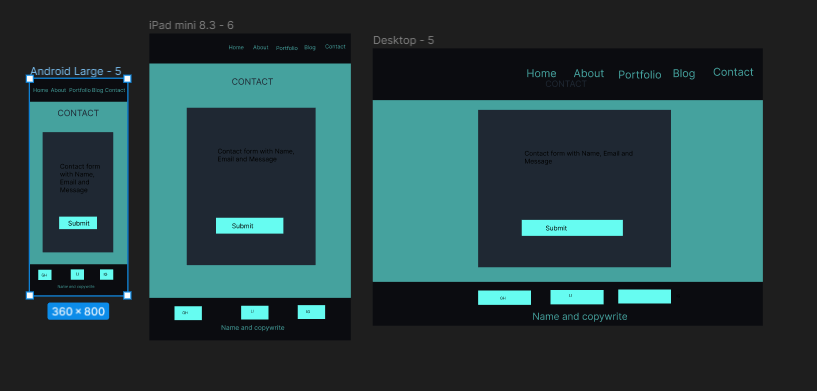

# Nathan's Portfolio Website

## Overview 
Welcome to my web developer portfolio! This website showcases my skills, projects, and experience in web development. Here you will find a five page website, demonstrating my proficiency in designing and creating a responsive website.  Whether you are a potential employer, client, or fellow developer, I hope you find my portfolio both informative and inspiring.

## Website Links
* Portfolio website - https://nathan-portfolio-t1a2.netlify.app/
* Github Repository - https://github.com/keennathan/2024-apr-std-portfolio-T1A2

## Target Audience
The target audience is for potential employers or anyone looking to engage the expertise of a web developer.

## Components

### Header
The header component includes my logo and a navigation bar with links to all the pages. It remains consistent across all pages.

### Footer
The footer includes social media icons linking to my profiles, contact information, and a copyright notice. It's present on every page.

### main
The main component is the main body of content on each page.  It icludes images, text and links to different pages of work.

## Pages

### Home Page
Home page displays a logo that links to the home page. It has a breif introduction and what I do and a link to the about page.  The button component has a hover feature.

### About Page
The about page offers insights into my background, skills, and interests. It includes a link to my resume and features hover effects for engagement.

### Portfolio Page
The portfolio page showcases selected projects through interactive cards with project details and links. Hover animations add visual appeal.

### Blog List Page
The blog page lists articles with publication dates, authors, and excerpts. Each article links to a dedicated page with the full content. Hover effects enhance user interaction
#### Blogpost Pages
Dedicated pages for each blog post display the full content with a back button for navigation.

### Contact Page
The contact page features input fields for user queries and a submit button. Interactive styling highlights active input sections.

## Tech Stack
In this website the following technology was used:
* HTML5 - to create the structure of the website.
* CSS - to create the style and formatting of the html document.
* Figma - was used to create the sitemap and the wireframes.
* Trello - was used for managing this project with timeline for each small task.
* Git - for tracking changes made to the codebase.
* VS Code - used to write the code.
* Netlify - was used to upload to the internet.
* coolors - to create the colour palette.

## Sitemap
The sitemap was created using figma.  It is to design the structure and relationships between the pages of the website.  There are 5 main pages of the site which are:
* Home/Landing page
* About Me page
* Portfolio Page
* Blog Page
* Contact Page

## Wireframes
The wireframes were created using figma, they are a rough way to showcase the pages layout and design.  I designed 3 different screens for mobile, tablet and desktop for all the pages.  I went for a minimalist Home page, and with the colour palette I've choosen, to create a sense of class and style. 
### Home/Landing Page

### About Me Page

### Portfolio Page

### Blog Page

### Contact Page
